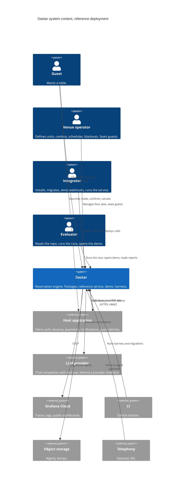
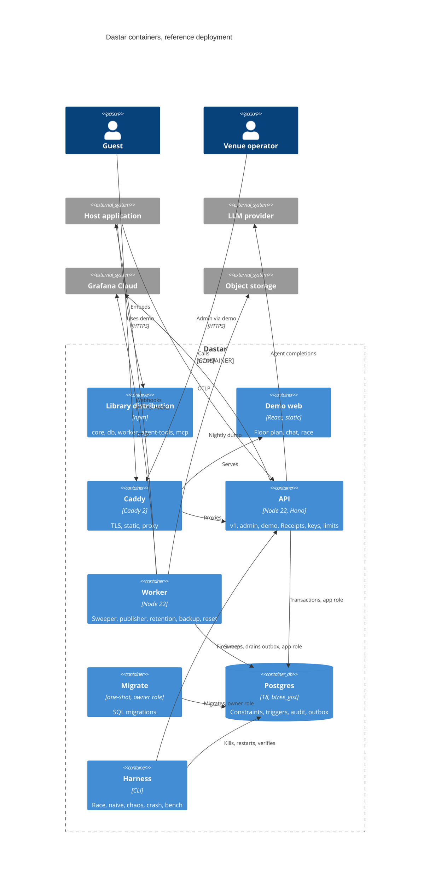
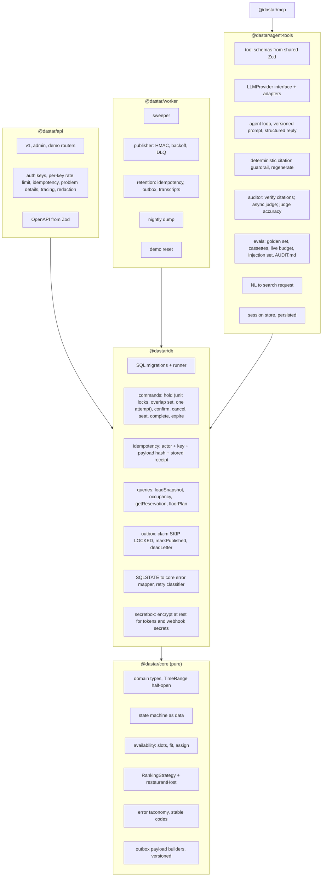

# Dastar: System Design

Status: v0.11, 2026-09-10. Design frozen pending prototype results; section 20 records the review findings that shaped it, and `results-2026-09-10-prototype.md` records what the prototype showed. Estimates assume a part-time solo maintainer.

---

## 0. Summary

Dastar is an open-source reservation engine for exclusive inventory: indivisible units with capacity ranges, fixed combinations of units, holds that expire, party sizes that must fit, and many clients racing for the same slot. A unit is booked by at most one reservation at a time; that is the property the database enforces. Quantity-based or pooled inventory, such as fifty tickets to one show, is a different problem with a different constraint and is out of scope. Restaurant tables are the first adapter; rooms, specific rental items, and vehicles or guides on tours fit the same model. Its one promise is that it never oversells, and that promise is enforced by Postgres, not by application code.

It is library-first: host apps import `@dastar/core` and `@dastar/db` into their own Node process and Postgres and keep auth, tenancy, and payments. A reference deployment (Hono API, worker, Postgres, Docker Compose) serves the public demo, the test harness, and non-Node hosts. Above the engine sits an agent layer whose tools derive from the same Zod schemas as the HTTP API, with a booking agent that can hold but never confirm, a guardrail that rejects uncited declared claims and constrains what the agent can do, a deterministic auditor, and an eval suite that runs in CI.

Target readers of the repo: engineers deciding whether to trust the engine, and teams deciding whether to adopt it. Both are first-class actors in this design. A third audience is agent builders: Dastar is also a deterministic, self-hostable booking backend for developing and testing reservation agents, and it can audit any agent's claims against the receipts it issued, over plain HTTP, with no SDK.

---

## 1. Principles

1. **Postgres enforces.** Every invariant is a constraint or trigger, and the application connects as a role that cannot remove them. TypeScript orchestrates transactions and maps errors. A raw-SQL attack suite, run as the application role, proves the database refuses violations on its own.
2. **One schema, four surfaces.** Zod definitions generate the OpenAPI document, the typed client, the LLM tool definitions, and the MCP server. CI fails on drift.
3. **Agents hold, humans confirm.** Agent keys cannot confirm. Confirmation needs a confirm-capable key or a single-use confirm token that is handed to a human, and the human confirms a reservation whose details were read back from the server, never described by the model.
4. **Every claim has a receipt.** Every mutation returns a receipt. Every agent statement about booking state must cite one. The auditor checks, and the auditor's own accuracy is measured and published. The guardrail checks declared claims and constrains actions; it does not detect every false statement and is not a general solution to hallucination.
5. **Every bug gets a replay.** Property-test sequences, harness histories, and agent transcripts are recorded and replayable.

---

## 2. Decision log

| # | Decision | Chosen | Rejected | Why |
|---|---|---|---|---|
| D1 | System boundary | Library first; Hono API as reference deployment | Standalone service only; both equal | Matches the "enforced by Postgres" story and the package layout |
| D2 | Invariant enforcement | Constraints and triggers for every invariant; TS orchestrates | TS guards; PL/pgSQL commands | Makes the tagline literally true; attack tests become possible |
| D3 | Hosting | One VPS, Docker Compose, Postgres on the box, Cloudflare in front | PaaS plus managed Postgres; Vercel plus Neon | Same compose as quickstart; chaos and benchmarks are real; free managed tiers sleep |
| D4 | Traces and logs | Grafana Cloud free tier, OTLP exported directly from api and worker | Self-hosted Jaeger; Honeycomb; a collector container | Alerting and retention for free; one fewer moving part on a single box |
| D5 | Query layer | Kysely with plain SQL migrations and generated types | Drizzle | Constraints and triggers are hand-written SQL anyway. Superseded by D46: the query layer is `pg` directly. |
| D6 | Confirm authorization | A confirm-capable key, or a single-use confirm token minted through a confirm-capable key and handed to a human channel. The hold response never contains a token | Token in the hold response; key only | A token in the hold response hands every hold-only agent a confirm credential. Minting requires confirm authority, so "agents hold, humans confirm" holds for any hold-only key, not only the reference agent |
| D7 | Assignment representation | `assignment_kind` and `assignment_id` on reservation; unit rows derived and verified by a deferred trigger | Unit rows only | Fit trigger reads one row; membership trigger closes the gap between the two tables |
| D8 | Migrations | In-house runner, ordered SQL files, checksums, forward-only, lock timeout with retry, advisory lock, per-file transactional or concurrent mode, expand-then-contract from migration 002. Reconsidered in v0.10 and kept for v0.1, bounded to those five behaviors; a sixth need means adopting an existing tool | dbmate, node-pg-migrate, graphile-migrate | No single tool covers checksums, an advisory run lock, and non-transactional files together; a bounded runner is less surface than a dependency plus workarounds. Safety under load is a hypothesis (H6) with a named test |
| D9 | Reference server API keys | Table with hashed keys, capabilities, venue scope | Env vars | Several keys and revocation for the demo |
| D10 | Optimistic concurrency | Optional `expected_version` on confirm and cancel | Status guards only | Receipt already carries version |
| D11 | Queueing | Postgres only: `FOR UPDATE SKIP LOCKED` for sweeper and outbox | Redis, SQS | No second datastore |
| D12 | Consistency boundary | Venue. No transaction spans venues | Global | Sharding by venue stays possible |
| D13 | Clock | `dastar_now()` owned by the owner role. In production it is `now()`. Test databases replace its body with a version that reads a transaction-local setting | A GUC gate; app clock | Custom GUCs are settable by any session, so a gate on them is not a gate |
| D14 | Workers | Separate `@dastar/worker` package and container; importable in-process | Bin inside API | Chaos test kills it independently |
| D15 | Identifiers | UUID v7 via native `uuidv7()` on Postgres 18 | Hand-rolled on 17; bigint | One less function in the attack surface |
| D16 | Outbox writes | Commands write outbox rows through a typed, versioned payload builder | Audit trigger writes them | Public payloads shaped in TypeScript, tested and versioned; no accidental column leaks |
| D17 | Availability caching | Static snapshot cached by a venue config version bumped only on config writes; occupancy read live | Version bump on reservation writes | A bump per reservation would serialize a venue's bookings on one hot row |
| D18 | Actor on writes | Trigger rejects any reservation write without `dastar.actor` set | Default actor | Audit rows are never anonymous |
| D19 | Database roles | `dastar_owner` (migrations, owns everything), `dastar_app` (DML grants only, no ownership, no TRUNCATE, statement and idle timeouts), `dastar_readonly` | One role | Without this, the app can disable every guard and the attack suite proves nothing |
| D20 | Hold transaction shape | One outer transaction claims the idempotency key, takes the per-unit advisory locks (D39), locks every occupying reservation that overlaps the requested units in reservation-id order, expires the dead ones, then makes a single booking attempt under a savepoint and stores the outcome under the still-owned key before committing. A deadlock or serialization error retries the whole outer transaction once | Skip-locked inline expiry; conflict-then-expire-then-retry; lock ordering per phase or per discovering unit | The key is owned from claim to stored outcome. The overlap lock set is time-independent and canonically ordered, so two holds on disjoint units that meet the same combo reservations lock them in the same order, and by construction nothing should be flipping a row on the requested units while the insert runs |
| D21 | Judge model | Runs asynchronously over stored transcripts; inline guardrail is the deterministic citation check only; judge precision and recall are measured against a hand-labeled set and published | Inline judge in the request path | Cost and latency; an unmeasured judge cannot back a published number |
| D22 | Backups | Nightly logical dump to object storage, one executed and documented restore drill | None | A trust-themed repo without a restore drill reads badly; it costs two hours |
| D23 | Scope | Correctness fixes, naive mode, deterministic auditor, model-based tests, crash test, architecture group, guardrails and evals, MCP | Stretch group | Stretch parked as M6 |
| D24 | Bring-your-own-agent audit | Any agent calls the API with a session header; Dastar records receipts under the session; the agent posts its transcript; the auditor matches claims to receipts | Auditor limited to the reference agent | Gives the audit report a reason to exist beyond this repo's own agent; two days in M3 over plain HTTP |
| D25 | Hosted sandbox with free keys | Built in M5 only if the M1 launch produces signals: clones, issues, anyone asking for keys | Build it unconditionally | Abuse surface, LLM bill, and support load; the ten-dollar floor-plan demo is enough without signal |
| D26 | Venue isolation | Row-level security on every venue-scoped table, keyed on a transaction-local `dastar.venue_id`, enforced for `dastar_app`; a separate `dastar_worker` role bypasses it for cross-venue loops. Context set in M1, policies on in M2 as invariant 10 | Host-only isolation; an unset context meaning all venues | A host bug passing the wrong venue id is the failure class the design claims to prevent; fail-closed is the only safe default. This is a bug-containment boundary, not an authentication one: the app role declares the context and can declare it wrongly; the API key check in the API process is what authenticates |
| D27 | Transcript scrubbing | Pattern-based masking of emails, phone numbers, and long digit runs at intake for every stored turn; names not attempted; redact-first ask stays | Trust builders to redact; model-based name detection | Cheap, deterministic, and honest about its limits |
| D28 | Live floor plan transport | Server-sent events carrying outbox ids as refresh hints, with periodic reconciliation (D36); listen-notify only as an optional wake-up on a dedicated connection | Listen-notify as the mechanism; polling occupancy alone | The event stream already exists; pooler-safe; no new moving part |
| D30 | Idempotency outcomes | Domain outcomes are stored under the key inside the same outer transaction that claimed it, whether the booking savepoint succeeded or rolled back: success, hold_conflict, party_does_not_fit, blackout. Transport and validation failures are not | Store successes only; store the conflict in a follow-up transaction | Invariant 3 holds unconditionally within the retention window; a client that wants to try again uses a new key |
| D31 | Unit-row churn | Per-table autovacuum settings on `reservation_unit` from the first migration; a sustained churn benchmark in M2; list-partitioning by venue documented as the escape hatch | Trust defaults; partition now | Flipping `active` is a non-HOT update, one dead index entry per terminal hold; measure it before designing for it |
| D32 | Estimation policy | Milestone estimates carry a 30 percent buffer; re-baseline after M1 against actual hours; a written cut line applies if behind after M2 | Point estimates | Solo estimates miss; the cut line protects the minimum credible release |
| D33 | Trust boundary | Two boundaries, stated in 6.1. Boundary A holds against an adversarial `dastar_app`: constraints, check-and-raise triggers, table and column grants, and three security-definer triggers that are the only writers of `active`, audit rows, and `version`. Boundary B is declared context (actor, trace id, venue) that the database checks for presence and consistency but cannot authenticate | A transaction-local internal flag as proof of trusted origin | Custom settings are user-settable, so a flag proves nothing; grants and definer functions do |
| D34 | Combo immutability | `unit_combo.unit_ids` and capacities never change after insert; operators deactivate and recreate. Column grants enforce it for the app role and a trigger backstops it for the owner | Versioned combos; assignment snapshots on the reservation | An existing reservation's assignment can never change meaning, and invariant 9 stays checkable without a second copy of the member set |
| D35 | Claim matching | A claim is matched against the latest recorded state of that reservation as of the turn, on status, start time, and party size; matching an older receipt is a violation | Any receipt in the session | "Was confirmed" and "is confirmed" are different statements; only the second is a safe thing to tell a guest |
| D36 | Live events | Outbox ids on the stream are refresh hints; the client reconciles from a full snapshot on connect, on every hint, and every thirty seconds | A delivery cursor over identity ids | Identity ids are assigned at insert, not commit, so a cursor can skip a row that commits late |
| D37 | Product boundary | Exclusive reservation of indivisible units and fixed combinations. Quantity and pooled inventory are out of scope | "Capacity-based inventory" as a broad claim | The exclusion constraint cannot express a sum of quantities; claiming ticketing would be false |
| D39 | Unit lock protocol | A transaction-level advisory lock per unit, keyed by unit id, acquired in sorted unit order: by the hold command at the start of its outer transaction, by the fit trigger on reservation insert, and by the capacity trigger on unit update | Lock-order arguments across phases; skip-locked expiry; accepting deadlocks as normal | Two holds that share a unit never run concurrently. This has a real cost: holds on the same unit for different, non-overlapping dates could otherwise commit concurrently and are instead serialized for the duration of a hold transaction, which is unmeasured until the prototype runs (H2). Accepted as the initial trade and as the prototype baseline; serialization across unrelated dates is a documented cost, not a defect. Any future refinement, such as a lock keyed by unit and time bucket, is not a drop-in replacement: it must preserve coordination for overlapping ranges, multi-unit bookings, the overlap lock set, expiry, and capacity edits, and it is considered only if the prototype's non-overlapping-dates measurements show the cost matters (6.5). The third review's interleaving, a retained expiry lock waiting on a fresh insert, is designed not to occur. Deadlock errors stay mapped and retried once as defense in depth, and the harness asserts zero (H1) |
| D40 | Unit capacity | Capacities are current values. A capacity change that would leave a live reservation assigned directly to the unit outside the new range is rejected by trigger DA012, which takes the unit's advisory lock first; the admin route offers reject-or-force | Immutable capacities with deactivate-and-recreate; app-level check only | Recreating a unit cascades into layouts and immutable combos; a trigger holding the unit lock closes the race against concurrent holds at boundary A. Confirm takes the same unit locks before its row lock and the fit check runs on the transition to confirmed (D45 area, section 10.2), so an edit and a confirmation on one unit serialize and the second sees the first's committed state. |
| D41 | Transitions versus metadata | The transition trigger evaluates the allowlist only when status changes. Same-status updates are metadata updates limited by column grants; token minting is one, requires a held unexpired reservation (DA013), replaces the previous hash, bumps version, and is audited with the hash redacted | A literal allowlist on every update | A literal reading would reject minting and external-reference updates |
| D42 | Claim verdicts | Reference agent: present-tense claims are checked against a fresh read at guardrail time. External audits: the verdict is "supported by the latest session observation as of the builder-supplied timestamp", and current state at audit time is reported alongside | Session observation only, for both | Operator cancellations and silent expiry never appear in a session's tool log |
| D43 | Effective status | Reads, tool results, the floor plan, capacity and liveness checks, and claim matching use `effective_status`: `expired` when a stored `held` row is past `hold_expires_at` by database time, otherwise the stored status. Receipts and the audit log record stored transitions | Stored status only | A hold that the sweeper has not reached is still expired; a fresh read that says held would let a guardrail approve a false claim |
| D44 | Token hash lifecycle | Setting a non-null hash requires a held, unexpired reservation before and after the update. Clearing the hash is always allowed. Every transition out of held clears it | A single guard on the new row's status | A guard on the new status would reject the confirmation that consumes the token |
| D45 | Connection ownership | Commands run only through a handle built from a host-supplied pool; each checks out a client, runs, and releases it after settlement, with an acquire timeout, a deadline with backend cancellation, and discard of any connection whose state is uncertain. No host transactions | A transaction-state guard on caller-supplied clients; composing inside host transactions with savepoints | A command's `begin` and `commit` on a client inside a host transaction would commit or discard the host's work; the retry in hold cannot run inside a host transaction |
| D46 | Query layer | `pg` directly with hand-written SQL | Kysely (D5) | Every statement is already hand-written; a query builder would add a layer without removing any |
| D47 | Nontransactional migrations | A `transaction: no` file is exactly one concurrent index statement in canonical spelling; the runner validates any existing index of that name by table, definition, and validity before recording, dropping, or applying | Free-form nontransactional files; removing the mode | A failed concurrent build leaves an invalid index and a re-run must neither trust a name match nor rebuild a finished index |
| D29 | Partitioning | Deferred with named trigger conditions: audit_log past tens of millions of rows, or vacuum duration visible in monitoring. Outbox is bounded by retention | Partition audit_log and outbox now | Partition keys in every unique constraint and ongoing partition upkeep are real costs; point lookups do not degrade with size; the named bottleneck is GiST churn, which partitioning does not touch |

---

## 3. System context, C4 level 1

Two deployment modes, one boundary. Embedded: the host app imports the packages and owns Postgres; API and worker collapse into the host's process. Reference: Dastar ships them. Dastar owns availability, holds, confirmation, seating state, audit, outbox events, agent tools, and the auditor. The host owns auth, tenancy, payments, guest notifications, and guest identity. Venue is the unit of isolation; mapping tenants to venues is the host's job.

Guest personal data never enters the engine schema. Hosts correlate through `external_ref`. This is a hard rule because the audit log is append-only and cannot honor an erasure request.

| Actor | Who | Touches Dastar through |
|---|---|---|
| Guest | Wants a table | Host app UI, or the chat agent in the demo |
| Venue operator | Manager or host | Admin API, demo floor plan |
| Integrator | Developer on the host app, or an agent builder testing against Dastar; also wears the SRE hat | npm packages, migrations, API, webhooks, compose, session header and audit endpoint |
| Evaluator | Prospective adopter, reviewer | README, race command, demo site, audit file, benchmarks |



---

## 4. Containers, C4 level 2

| Container | Tech | Responsibility |
|---|---|---|
| Library distribution | npm: `@dastar/core`, `@dastar/db`, `@dastar/worker`, `@dastar/agent-tools`, `@dastar/mcp` | What host apps embed |
| API | Node 22, Hono, Zod | v1, admin, demo routes. Capability keys, per-key rate limits, idempotency, receipts, OTLP export. Exported as an app factory |
| Worker | Node 22, same image | Sweeper, outbox publisher, retention (idempotency, outbox), backup trigger, demo reset |
| Migrate | Node 22, one-shot, connects as `dastar_owner` | Applies SQL migrations then exits; API and worker wait on it |
| Postgres | 18, btree_gist | Constraints, triggers, audit, outbox. The only state |
| Demo web | React, Vite, static | Floor plan, chat, race button |
| Caddy | Caddy 2 | TLS, static files, reverse proxy |
| Harness | CLI, `apps/harness` | Race, naive mode, mixed load, chaos, crash, bench. Laptop or CI |
| MCP server | stdio, `@dastar/mcp` | Same tools for any MCP client |

Only migrate connects as `dastar_owner`. API, harness, and the attack suite connect as `dastar_app`, which is subject to row-level security from M2. The worker connects as `dastar_worker`, which bypasses row-level security because sweeping, publishing, and retention run across venues.



---

## 5. Components, C4 level 3

**Dependency rule, enforced by dependency-cruiser in CI.** core imports nothing from the repo. db imports core. api, worker, agent-tools import db and core. mcp imports agent-tools. demo and harness sit on top.



**core.** Domain types with a half-open `TimeRange`. State machine as a data table, hand-written into the SQL trigger, with an exhaustive test over every from-to pair. Availability is three pure functions: candidate slots from a schedule, fitting assignments from units and combos, ranking through a `RankingStrategy` with `restaurantHost` as default. Error taxonomy with stable codes reused by every surface. Versioned outbox payload builders. Time zone math through a small Temporal-compatible library chosen by bundle size in M2.

**db.** Migrations and runner. Commands, one transaction each, returning a receipt, with a retry classifier for deadlock and serialization errors. Idempotency stores actor, key, payload hash, and the exact response. Snapshot and occupancy queries. Outbox claim and ack. SQLSTATE mapper. A secretbox helper for encrypting confirm tokens and webhook secrets at rest with a key from the environment. Every command sets `dastar.actor`, `dastar.trace_id`, and `dastar.venue_id` as transaction-local settings at the start; from M2 the venue setting is what row-level security keys on, so a transaction that forgets it reads nothing and inserts nothing.

**api.** Routers for v1, admin, demo (flagged). Middleware: capability keys, per-key token buckets in memory, idempotency header handling, Problem Details, tracing with the trace id echoed in receipts, and log redaction so a confirm token never appears in a log line or span. OpenAPI from Zod; docs UI and drift check arrive in M2.

**worker.** Sweeper expires due holds through the same command path in small batches. Publisher signs, delivers with backoff, dead-letters. Retention purges idempotency rows past their purge time, published outbox rows older than seven days, and demo transcripts older than thirty days. Backup runs the nightly dump. Demo reset reseeds nightly when flagged.

**agent-tools.** Tool definitions from the shared schemas, executed via a library binding or an HTTP binding, with tool-result strings length-capped and control characters stripped before they enter the model context. `LLMProvider` interface with an Anthropic adapter first, OpenAI-compatible second. Agent loop with a versioned prompt file whose hash goes on every span, forcing a structured reply. Inline guardrail: every declared claim must match a receipt in the session's tool log, or the reply regenerates at most twice, then falls back to a receipt-only message. Async auditor: a judge model scans stored turns for undeclared claims, and its precision and recall against a hand-labeled set are published beside the hallucination rate. Session store persisted in `dastar_agent`, holding encrypted confirm tokens so an API restart strands nothing. Evals: golden conversations, recorded cassettes on PR, live nightly under a spend cap, a basic prompt-injection set, and a report that writes `AUDIT.md`. Parser turns free text into a structured search request.

**mcp.** stdio MCP server over the tool definitions; base URL plus a hold-only key by default.

---

## 6. Data model

Schema `dastar` for the engine, schema `dastar_agent` for transcripts. All timestamps `timestamptz`. All ranges `tstzrange` with `[)` bounds. Everything is owned by `dastar_owner`.

```
venue             id uuid pk default uuidv7(), name, timezone text,
                  hold_ttl_seconds int check (between 60 and 3600) default 600,
                  slot_minutes int check (in (5,10,15,20,30,60)) default 15,
                  availability_window_days int check (between 1 and 90) default 14,
                  max_live_holds_per_actor int check (between 1 and 100) default 5,
                  config jsonb default '{}', config_version bigint default 0, created_at
unit              id, venue_id, label, capacity_min int, capacity_max int, active bool, layout jsonb, created_at
                  unique (venue_id, id)
unit_combo        id, venue_id, label, unit_ids uuid[], capacity_min, capacity_max, active bool
                  unique (venue_id, id)
schedule          id, venue_id, day_of_week smallint, opens time, closes time, closes_next_day bool default false,
                  duration_by_size jsonb check (jsonb_typeof(duration_by_size) = 'object'), gap_minutes int
blackout          id, venue_id, during tstzrange, reason
reservation       id uuid pk default uuidv7(), venue_id, party_size int, during tstzrange,
                  status reservation_status, assignment_kind assignment_kind, assignment_id uuid,
                  hold_expires_at timestamptz, version int not null default 1,
                  confirm_token_hash bytea null, cancel_reason text null, external_ref text null,
                  created_at, updated_at
                  unique (venue_id, id); index (venue_id, external_ref) where external_ref is not null
reservation_unit  venue_id, reservation_id, unit_id, during tstzrange, active bool
                  pk (reservation_id, unit_id)
                  fk (venue_id, reservation_id) -> reservation (venue_id, id)
                  fk (venue_id, unit_id) -> unit (venue_id, id)
                  EXCLUDE USING gist (unit_id WITH =, during WITH &&) WHERE (active)
idempotency       venue_id, actor text, key text, request_hash bytea, response jsonb null,
                  created_at, purge_at timestamptz, pk (venue_id, actor, key)
audit_log         id bigint identity, venue_id, entity, entity_id uuid, action, before jsonb, after jsonb,
                  actor text, trace_id text, at timestamptz
outbox            id bigint identity, venue_id, topic, payload jsonb, payload_version int, created_at,
                  attempts int default 0, next_attempt_at timestamptz, published_at null, dead_lettered_at null
webhook_endpoint  id, venue_id null (null = all venues), url, secret_enc bytea, active bool, created_at
api_key           id uuid, label, key_hash bytea unique, capabilities text[], venue_ids uuid[] null (null = all),
                  created_at, revoked_at null
schema_migration  version int pk, name, checksum bytea, applied_at

dastar_agent.session       id, venue_id, api_key_id, kind session_kind (reference | external),
                           model null, prompt_hash null, started_at, last_seen_at
dastar_agent.session_hold  session_id, reservation_id, confirm_token_enc bytea, created_at, pk (session_id, reservation_id)
dastar_agent.turn          id, session_id, role, content jsonb, claims jsonb, guardrail_fired bool,
                           judge_result jsonb null, at
dastar_agent.tool_call     id, turn_id, tool, input jsonb, output jsonb, receipt jsonb, at
```

Enums: `reservation_status` = held, confirmed, seated, completed, cancelled, expired. `assignment_kind` = unit, combo. `session_kind` = reference, external.

Indexes.
- `reservation (hold_expires_at) WHERE status = 'held'` for the sweeper and conflict-time expiry.
- `reservation_unit` gist `(venue_id, during) WHERE active` for occupancy, via btree_gist.
- `outbox (next_attempt_at, id) WHERE published_at IS NULL AND dead_lettered_at IS NULL`.
- `outbox (published_at) WHERE published_at IS NOT NULL` for retention.
- `api_key (key_hash)` unique.
- `idempotency (purge_at)`.
- `audit_log (entity_id, at)`.
- `dastar_agent.turn (session_id, at)`.

Notes.
- `reservation_unit.during` is the source of truth for the exclusion constraint. `reservation.during` is kept for queries; DA008 asserts equality.
- `reservation_unit.venue_id` is denormalized and immutable. The two composite foreign keys make a cross-venue attachment impossible.
- Booking a combo inserts one `reservation_unit` row per member. A deferred constraint trigger (DA010) asserts at commit that the sorted set of unit rows, active or not, equals the member set implied by the assignment.
- `unit.capacity_min` and `capacity_max` are current values (D40). Trigger DA012 on a capacity update acquires the unit's advisory lock, then rejects the change if any live reservation, by effective status, with `assignment_kind = 'unit'` on this unit would fall outside the new range.
- `effective_status` (D43) is a derived value, `expired` when `status = 'held' and hold_expires_at <= dastar_now()`, otherwise `status`. It is what every read path returns and what liveness means everywhere in this document; the stored column catches up when the sweeper or a hold's overlap pass expires the row. Completed, cancelled, and expired reservations are history and unaffected. The admin route's force option cancels the conflicting reservations through the cancel command before updating. Combos carry their own capacities and are immutable (D34).
- `active` is flipped to false by the sync trigger when status becomes cancelled or expired. The sync trigger is `SECURITY DEFINER`, and `dastar_app` has no UPDATE or DELETE privilege on `reservation_unit`, so nothing but that trigger can change `active` or remove a row; a direct attempt fails with 42501. Rows are inserted only at hold time with `active = true`, which the insert guard (DA008) checks along with the range.
- `unit_combo.unit_ids`, `capacity_min`, and `capacity_max` are immutable after insert (D34): `dastar_app` may update only `label` and `active`, and trigger DA011 backstops the rule for the owner role. Operators change a combo by deactivating it and creating a new one.
- `confirm_token_hash` stores sha256 of a 32-byte random token. Tokens are minted on demand through `POST /v1/reservations/:id/confirm-token`, which requires the `confirm` capability; the hold response never contains one. Minting again replaces the previous token. Confirm with a token nulls the hash.
- `version` is bumped by trigger on every update of `reservation`; client-supplied version changes are rejected.
- `venue.config_version` is bumped by trigger on writes to unit, unit_combo, schedule, blackout, and venue. It is never bumped by reservation writes.
- Idempotency: `actor` is `key:<api_key_id>` in API mode and the caller-supplied actor in library mode. `purge_at` is `created_at + 24h`; stored responses contain no secrets because hold responses carry no token. `request_hash` is computed over the parsed, canonicalized body, not raw bytes. The outcome is written under the key inside the same outer transaction that claimed it (D30, section 10.1), so a retry within the retention window returns the same outcome, and after purge the key is simply fresh.
- `reservation_unit` carries per-table autovacuum settings (`autovacuum_vacuum_scale_factor = 0.02`, `autovacuum_analyze_scale_factor = 0.02`) because every terminal hold leaves one dead entry in the exclusion index.
- `webhook_endpoint.secret_enc` and `session_hold.confirm_token_enc` are encrypted at rest with a key from the environment.
- `schedule.closes_next_day` expresses a service period that ends after midnight.
- Capabilities: `read`, `hold`, `cancel`, `confirm`, `seat`, `admin`, `demo`. Agent keys get `read, hold, cancel`; the tool executor further restricts cancel to reservations created in the same session.
- Retention: idempotency by `purge_at`; published outbox rows deleted after seven days; demo and external-audit transcripts after thirty days; audit_log is never deleted, which is why no guest data may enter it.
- Any v1 call that carries a `Dastar-Session: <id>` header is recorded as a `tool_call` row with the route name as the tool and the receipt attached, so an external agent gets the same receipt log as the reference agent. The session must belong to the calling key.

### 6.1 Roles and session settings

```sql
-- dastar_owner:    owns schema, tables, and functions; used only by the migration runner.
-- dastar_app:      USAGE on schemas, EXECUTE on functions, and the table and column grants below.
--                  No ownership, no DELETE anywhere, no TRUNCATE, no DDL. Subject to row-level security (M2).
-- dastar_worker:   dastar_app's grants plus UPDATE on outbox, DELETE on idempotency, outbox, and
--                  dastar_agent tables for retention, and BYPASSRLS. Used only by the worker container.
-- dastar_readonly: SELECT only.
ALTER ROLE dastar_app SET statement_timeout = '10s';
ALTER ROLE dastar_app SET idle_in_transaction_session_timeout = '30s';
ALTER ROLE dastar_worker SET idle_in_transaction_session_timeout = '30s';
```

Grants for `dastar_app`:

| Table | Grants |
|---|---|
| unit, schedule, blackout, webhook_endpoint, api_key | SELECT, INSERT, UPDATE. No DELETE; rows are deactivated or revoked. Unit capacity updates pass through trigger DA012 |
| venue | SELECT, INSERT, UPDATE on the config columns only; `config_version` is written solely by the security-definer config-version trigger |
| unit_combo | SELECT, INSERT, UPDATE (label, active) |
| reservation | SELECT, INSERT, UPDATE (status, cancel_reason, confirm_token_hash, external_ref, updated_at). `during`, `party_size`, `assignment_kind`, `assignment_id`, `hold_expires_at`, `venue_id`, `version`, `created_at` are immutable for the app role |
| reservation_unit | SELECT, INSERT. No UPDATE, no DELETE |
| idempotency | SELECT, INSERT, UPDATE (response) |
| audit_log | SELECT only. The audit trigger is the only writer |
| outbox | SELECT, INSERT |
| schema_migration | SELECT |
| dastar_agent.* | SELECT, INSERT, UPDATE (session.last_seen_at, turn.judge_result) |

The three triggers that write rows other than the one being written, the audit insert, the unit-row flip, and the venue config-version bump, are `SECURITY DEFINER` functions owned by `dastar_owner` with a fixed `search_path`. A BEFORE trigger that edits the row being written, such as the version bump or the transition trigger clearing `confirm_token_hash`, is not in this class and runs with the caller's rights. Schema USAGE is granted in the same migration that defines the functions it makes callable (0003); table and column grants follow in 0005. That is what lets the app role be denied the privileges those triggers need. A BEFORE trigger may set `NEW.version` regardless of the caller's column grants, and the audit and sync triggers run as owner, which also means row-level security does not apply to them.

Two trust boundaries, and CORRECTNESS.md names which one each invariant sits behind.

Boundary A, adversarial. Invariants 1, 2, 4, 5, 7, 8, 9 and the supporting guards hold against a `dastar_app` that is buggy or hostile: it can issue any SQL its grants allow, set any custom setting it likes, and still cannot overlap two reservations, confirm an expired hold, confirm outside the state table, forge or edit an audit row, flip or delete a unit row, extend a hold, change a combo's members, or attach a unit from another venue. The attack suite exercises exactly this: forged internal settings, deleted unit rows, direct audit inserts, edits to `hold_expires_at`, edits to combo members, truncation.

Boundary B, declared context. `dastar.actor`, `dastar.trace_id`, and `dastar.venue_id` are declarations by the caller. The database enforces that they are present (DA007) and that a transaction is internally consistent with its declared venue (row-level security, invariant 10). It cannot verify that the declaration is true, because custom settings are user-settable and the app role can address every venue. What authenticates the declaration is the API key check in the API process, or the host application in embedded mode. Invariant 3 also sits here: the actor in the idempotency key is whatever the caller declared. CORRECTNESS.md states this plainly rather than implying the database authenticates tenants.

Row-level security, M2, boundary B. Every venue-scoped table gets `ENABLE ROW LEVEL SECURITY` and one policy of the form `USING (venue_id = current_setting('dastar.venue_id', true)::uuid) WITH CHECK (same)`. It contains a bug that mixes venues inside one transaction, and it fails closed when the context is missing; it does not stop a caller that declares the wrong venue on purpose. `api_key` and `schema_migration` are not venue-scoped and carry no policy; key lookup happens before the venue is known and then binds the venue setting from the key's scope. Foreign-key checks run as the table owner and are unaffected. The exclusion constraint checks the whole table regardless of policy, which is correct because a unit belongs to exactly one venue.

### 6.2 Clock

Production migration:

```sql
create function dastar_now() returns timestamptz language sql stable as $$ select now() $$;
```

Test setup, applied by the test harness as `dastar_owner` and never part of the numbered migrations:

```sql
create or replace function dastar_now() returns timestamptz language sql stable as $$
  select coalesce(nullif(current_setting('dastar.now', true), '')::timestamptz, now())
$$;
```

`dastar_app` cannot replace the function, so the override cannot exist in production. `now()` is transaction start time, so time is monotonic inside a transaction. Consequence: a confirm that waits on a row lock evaluates expiry against its own start time, granting a grace equal to its wait. Documented in CORRECTNESS.md as a property, not a bug.

### 6.3 Migration runner

Ordered SQL files, each applied according to its declared transaction mode, with `SET lock_timeout = '3s'` and up to five retries on lock timeout. The whole run holds `pg_advisory_lock` on a fixed key so two migrate containers cannot interleave. Checksums of applied files are verified on every run; a mismatch aborts. Forward-only; no down migrations. Expand-then-contract from migration 002: a column or constraint is added in one release and old shapes are removed only after the code that needed them is gone.

What `lock_timeout` does and does not do. It bounds how long a migration waits to acquire a lock, so a deploy fails loudly instead of queueing all traffic behind a lock request. It does not bound how long the migration holds the lock once acquired, and it says nothing about how much data a statement scans. Three properties of a migration are therefore tracked separately rather than folded into one label:

| Property | Values | Examples |
|---|---|---|
| Transaction compatibility | runs inside the runner's transaction, or must run outside one | `CREATE INDEX CONCURRENTLY` must run outside a transaction block. `VALIDATE CONSTRAINT`, `ADD COLUMN`, trigger changes, and plain `CREATE INDEX` run inside one |
| Locking impact | blocks nothing, blocks writes, or blocks reads and writes on the table | `VALIDATE CONSTRAINT` takes a lock that blocks neither reads nor writes. A plain `CREATE INDEX` blocks writes and permits reads. `ADD COLUMN`, `ADD CONSTRAINT ... NOT VALID`, and attaching or replacing a trigger take a lock that blocks everything, briefly. A table rewrite blocks everything for its whole duration |
| Expected duration | instant, or proportional to table size | `ADD COLUMN` with a null default and `NOT VALID` are instant. `CREATE INDEX CONCURRENTLY`, `VALIDATE CONSTRAINT`, and plain `CREATE INDEX` scan the table. A rewrite scans and rewrites it |

Each migration file declares two headers: `transaction: yes|no`, which the runner honors, and `impact`, one of `instant-exclusive`, `long-nonblocking`, `long-blocks-writes`, or `long-blocks-all`. The runner applies `instant-exclusive` and `long-nonblocking` migrations against a live system under `lock_timeout`; it refuses `long-blocks-writes` and `long-blocks-all` unless a maintenance window is explicitly asserted on the command line. Under this scheme, the preferred live-safe pattern for a new index is `CREATE INDEX CONCURRENTLY` outside a transaction, and for a new constraint it is `NOT VALID` followed by `VALIDATE CONSTRAINT` in a later file. Migration under load is a hypothesis (H6) with a named test in 15.1.

Runner decision, reconsidered in v0.10. The runner is kept for v0.1 and bounded to five behaviors: ordered files, checksums, the advisory run lock, per-file transactional or concurrent mode, and lock timeout with retry. No existing tool provides all five without workarounds. If a sixth behavior becomes necessary, an existing tool is adopted instead of growing the runner.

Nontransactional files, D47. A file declared `transaction: no` must contain exactly one statement, either `create [unique] index concurrently if not exists <name> on <schema>.<table> using <method> (...)` or `drop index concurrently if exists <schema>.<name>`, spelled as `pg_get_indexdef` would print it. Before a create, the runner looks up any relation of that name in that schema: none, apply; an index on the same table with the same definition, valid and ready, record the checksum without rebuilding; the same but invalid, drop it concurrently and apply; anything else, abort without dropping. `lock_timeout` is set per attempt and reset afterwards; the checksum is recorded only after success.

### 6.4 Trigger conventions

- One trigger function per invariant or supporting guard, each short enough to read in one screen. Triggers check and raise; the only three that write rows other than the one being written are the audit insert, the unit-row flip on terminal status, and the venue config-version bump, and those three are `SECURITY DEFINER` with a fixed `search_path` so the app role can be denied the underlying privileges.
- Trigger names carry a numeric prefix (`t10_actor_required`, `t20_transition`, `t30_expiry_guard`, ...) because Postgres fires same-event triggers in alphabetical order. The order is therefore explicit and reviewable, and CORRECTNESS.md lists it.
- Every `RAISE` uses `ERRCODE` for the SQLSTATE, `MESSAGE` for a one-line description, `DETAIL` for the ids involved, and `HINT` naming the invariant. The mapper turns these into typed errors with the same fields, so a trigger failure in production reads like an application error.
- The transition trigger is a seven-pair allowlist evaluated only when `NEW.status IS DISTINCT FROM OLD.status`. Same-status updates are metadata updates governed by column grants and section 8. The thirty-six-pair matrix in the tests is the proof, not the code.
- The audit trigger redacts `confirm_token_hash` from its before and after images.
- CORRECTNESS.md carries a trigger inventory: name, table, event, order, invariant, and the test that exercises it.

### 6.5 Workload bounds and provisional targets

Bounds a request may not exceed, enforced where the database can and rejected at the API otherwise:

| Bound | Value | Enforcement | Behavior beyond it |
|---|---|---|---|
| Combo size | 2 to 6 units | CHECK on `unit_combo` (`cardinality(unit_ids)`) | Admin route returns 422 `combo_too_large` |
| Booking duration | 5 minutes to 12 hours | CHECK on `reservation.during` (bounded, `upper - lower` within range) | 422 `duration_out_of_range`, mapped from 23514 by constraint name |
| Overlap lock set per hold | 64 reservation rows | Counted in step 5 of 10.1 before any row lock is taken | 503 `overlap_set_too_large` with Retry-After, retryable; a metric fires, since a healthy system never approaches it: for a future request the set is live conflicts plus unswept dead holds |
| Live holds per actor | 5, venue config | Policy check in the hold command | 429 `too_many_live_holds` |
| Availability window | 14 days, venue config | Policy check | 422 `window_too_large` |
| Units per venue | 200, soft | Not enforced | Documented in LIMITATIONS.md as the initial target scale |

Provisional workload target, for the prototype's go or refine decision. Labeled provisional: the numbers exist so a benchmark can support a decision, not because they are known to be achievable.

- Shape: one venue, 40 units, 10 combos, 15-minute slots. Offered load 50 holds per second sustained for 10 minutes, mixed 40 percent overlapping slots on the ten most popular units, 30 percent non-overlapping dates on the same units, 20 percent disjoint units, 10 percent combos. Confirm and cancel at 20 percent of hold volume. Sweeper on. Machine: the 4 vCPU 8 GB class with local Postgres.
- Targets: hold end-to-end p95 at or under 150 ms and p99 at or under 500 ms; pool-acquire wait p99 at or under 50 ms; advisory-lock wait p99 at or under 100 ms on the non-overlapping-dates mix, which is the direct measure of the D39 cost; zero deadlocks; error rate excluding legitimate conflicts at or under 0.1 percent; the race at N=5000 completes with one winner and zero overlaps.
- Decision rule: all targets met, the baseline stands and these numbers become the first line of BENCHMARKS.md. Advisory-lock wait on non-overlapping dates dominates p99 while everything else passes, the D39 refinement is scheduled for M2 with its coordination requirements stated in D39. Anything else misses, investigate the cause before touching the lock protocol.


---

## 7. Invariants

Each holds against the `dastar_app` role even when the application is adversarial (boundary A in 6.1), except invariants 3 and 10, which depend on declared context (boundary B). The attack suite connects as `dastar_app`.

| # | Invariant | Guard | SQLSTATE | Core error | Proving test |
|---|---|---|---|---|---|
| 1 | No unit is held or confirmed by two reservations with overlapping ranges | Exclusion constraint on active `reservation_unit` rows | 23P01 | hold_conflict | Race harness; attack: raw overlapping insert |
| 2 | An expired hold cannot be confirmed | BEFORE UPDATE trigger on reservation using `dastar_now()` | DA001 | hold_expired | Attack: set test clock past expiry, update status |
| 3 | Same actor, key, and payload returns the same outcome, success or domain error, within the 24-hour retention window, and creates nothing; different payload is rejected | PK on (venue, actor, key) plus hash check; the key is owned by one outer transaction from claim to stored outcome | 23505 / DA002 | idempotency_replay / idempotency_mismatch | Retry test; crash-after-commit test; lost-conflict retry test; concurrent same-key test |
| 4 | Assigned unit or combo fits the party within min and max, and stays fitting while the reservation is live | BEFORE INSERT/UPDATE trigger on reservation; BEFORE UPDATE OF capacity trigger on unit that takes the unit's advisory lock and checks live reservations; combo capacities immutable | DA003 / DA012 | party_does_not_fit / capacity_conflict | Attack: party 9 on a 4-top; shrink a 4-top to 2 under a live party of 4; capacity edit racing a hold from two connections; property tests |
| 5 | Audit log is append-only and written only by the audit trigger | BEFORE UPDATE/DELETE row trigger and BEFORE TRUNCATE statement trigger; `dastar_app` has SELECT only; the audit trigger is `SECURITY DEFINER` | DA004 / 42501 | audit_immutable | Attack: update, delete, truncate, and direct insert as app role |
| 6 | Every state transition writes an audit row | AFTER trigger on reservation | n/a | n/a | Audit row count equals transitions after random sequences; outbox completeness proven by the model-based test |
| 7 | Only transitions in the state table are possible | Hand-written BEFORE UPDATE trigger | DA005 | invalid_transition | Attack: completed to held; exhaustive test over all 36 from-to pairs |
| 8 | Every unit row of a reservation is active iff the reservation occupies its units, that is, its stored status is not cancelled or expired; completed rows stay active as history | The `SECURITY DEFINER` sync trigger is the only writer of `active`; `dastar_app` has no UPDATE or DELETE on unit rows; inserts must carry `active = true` for a held reservation | 42501 / DA006 | unit_rows_immutable | Attack: flip active by hand, delete a unit row, forge the old internal setting; complete a reservation and check rows stay active; model-based tests |
| 9 | The unit rows of a reservation, active or not, are exactly the members of its assignment in its venue, and that member set never changes after the hold | Deferred constraint trigger at commit compares the row set, ignoring `active`, to the assignment's members; composite foreign keys; combo immutability (D34) | DA010 / DA011 | assignment_mismatch / combo_immutable | Attack: combo A+B on the row with a unit row for table nine; unit from another venue; edit a combo's members; cancel, then check the rows remain and are inactive |
| 10 (M2) | A transaction bound to venue A cannot read or write venue B's rows, and an unbound transaction reads and writes nothing | Row-level security policies on `dastar.venue_id`, enforced for `dastar_app` | 42501 on write | venue_scope_violation | Attack as `dastar_app`: bound to A, select B's reservations returns zero rows, insert into B raises; unbound select returns zero rows |

Supporting guards: DA007 `actor_required`; DA008 `range_mismatch`, which also requires `active = true` and a held reservation on insert; DA009 `blackout` (M2); DA011 `combo_immutable`; DA012 `capacity_conflict`; DA013 `token_requires_held`, which fires when `confirm_token_hash` changes to a non-null value and requires `OLD.status = 'held'`, `NEW.status = 'held'`, and `OLD.hold_expires_at > dastar_now()`. Clearing the hash is never rejected, and the transition trigger sets it to null on every transition out of held, so confirmation consumes the token and cancellation or expiry discards it. Column grants make the reservation's range, party size, assignment, expiry, venue, and version immutable for the app role, so a direct edit fails with 42501 before any trigger runs.

Retryable errors, never surfaced as invariant failures: 40P01 deadlock_detected and 40001 serialization_failure map to `serialization_conflict`; commands retry once, then the API returns 409 with `Retry-After: 0`.

Isolation: READ COMMITTED everywhere. The reservation row is the lock point for every state change: confirm, cancel, seat, complete, and expiry all UPDATE `reservation` first, and the sync trigger touches `reservation_unit` inside that statement's trigger context.

Unit lock protocol (D39). A transaction-level advisory lock per unit, keyed by unit id, acquired in sorted unit order. The hold command acquires the locks for its assignment at the start of the outer transaction, before any savepoint. The fit trigger acquires the same locks on reservation insert, and the capacity trigger acquires the unit's lock on a capacity update, so the capacity race is closed even for a caller that bypasses the command.

Overlap lock set (D20). Before its booking attempt, a hold locks every occupying reservation that has an active unit row on any requested unit within the requested range, dead or live, in reservation-id order: a first statement collects the distinct ids, a second selects those rows `ORDER BY id FOR UPDATE`, which acquires the locks in that order. It then expires the dead ones through the expire command path. The set is stable while the hold runs, because the advisory locks stop any new unit row from appearing on those units and rows are never deleted, and its order does not depend on which requested unit discovered a reservation.

Why the reference paths are designed not to deadlock (H1). A hold acquires resources in three ordered stages and never returns to an earlier one: advisory locks in unit order, then reservation row locks in id order, then its own inserts. Two holds that share a unit serialize at the first stage. Two holds on disjoint units can meet at the second stage on the same combo reservations, and both lock them in id order, so one simply waits. By the time a hold inserts, it holds a row lock on every reservation that could be flipping a unit row on its units, so its inserts are designed to wait on nothing. Confirm, cancel, and token minting wait only on their own reservation row and hold nothing else; the sweeper skips locked rows and waits on nothing; the capacity trigger waits only on the unit lock. The intended wait-for graph among these paths has no cycle; the interleaving tests and the mixed-load run in 15.1 are what would falsify this. The third review's interleaving, a retained expiry lock against a fresh insert on a lower unit, is prevented at the first stage. The fourth review's interleaving, holds on U1 and U4 against U2 and U3 both expiring combos U1 and U3 and U2 and U4, is prevented at the second stage. Both are named two-connection tests and must produce a queue, never a deadlock: one winner in the shared-unit case, two winners in the disjoint-unit case.

This is a liveness property of the reference command path, not a correctness property. A caller that bypasses the advisory locks with raw SQL can cause a retryable deadlock and never an overlap. 40P01 and 40001 stay mapped to `serialization_conflict` and are retried once as defense in depth, and the mixed-load harness asserts that the count is zero. Until the prototype and its full trigger behavior have run the named interleavings, zero deadlocks is a hypothesis, not a result.

Holds occupy inventory for their TTL by design. Under a rush the levers are a short per-venue TTL and the per-actor live-holds cap, and LIMITATIONS.md says so. The lost-conflict case that would otherwise create a hold the client never sees is closed by D30.

### 7.1 Guarantees versus hypotheses

Nothing in this section is proven. The distinction is between properties the database is designed to enforce, which the attack suite and interleaving tests either confirm or falsify, and properties of runtime behavior that only measurement can settle.

Designed guarantees, unproven until the prototype's tests run:

- G1. Invariants 1, 2, and 4 to 9 hold against `dastar_app` within boundary A (6.1). Invariant 3 depends on the declared actor and sits in boundary B; it is covered by G2, not G1. Falsified by any attack-suite case that succeeds.
- G2. Invariant 3, outcome ownership per idempotency key within retention. Falsified by the concurrent same-key and crash tests.
- G3. The token lifecycle (D44). Falsified by the mint, consume, and clear tests.
- G4. Effective status semantics (D43). Falsified by the sweeper-disabled tests.

Hypotheses, to be validated experimentally in the prototype (15.1); the design may be wrong about any of them:

- H1. Zero deadlocks on the reference paths under the named interleavings and the mixed-load run.
- H2. Hold transaction duration, and therefore the cost of per-unit serialization across unrelated dates. Unmeasured.
- H3. Throughput and latency at the provisional workload target in 6.5.
- H4. The pool of 16 with a 5s acquire timeout and the 10s statement timeout produce the documented exhaustion behavior and recover cleanly.
- H5. Autovacuum keeps pace with unit-row churn. The settings in section 6 are initial tuning values, not proof.
- H6. Migrations can be applied under load without dropping traffic.

Passing every test in 15.1 is evidence for the tested workloads and failure scenarios, not a universal proof of deadlock freedom or scalability; the document says so wherever a result is reported. Wording rule for this document: runtime behavior is described as "designed to" or "expected to", never as certain, and each such statement names the test that would falsify it. Words such as "bulletproof" and "mathematically" do not appear.


---

## 8. State machine

Defined once as data in core, hand-written into the SQL trigger, with an exhaustive test.

| From | To | Trigger | Guard | Actor |
|---|---|---|---|---|
| held | confirmed | confirm | `hold_expires_at > dastar_now()`; token valid or key has `confirm` | key or token |
| held | cancelled | cancel | none | key with `cancel` |
| held | expired | expire | `hold_expires_at <= dastar_now()` | system:sweeper or system:conflict |
| confirmed | seated | seat | none | key with `seat` |
| confirmed | cancelled | cancel | reason required, includes no_show | key with `cancel` |
| seated | completed | complete | none | key with `seat` |
| seated | cancelled | cancel | reason required | key with `cancel` |

Terminal: completed, cancelled, expired. `version` increments on every transition. Two racing confirms: the loser gets `version_conflict` if it supplied `expected_version`, otherwise `invalid_transition`. That second outcome is the command layer's: after taking the row lock and checking any supplied version, confirm requires stored status `held` and cancel requires `held`, `confirmed`, or `seated`, and raises `invalid_transition` otherwise. At the database boundary a same-status write is a metadata update, which is not a transition and cannot violate an invariant, so the trigger does not and cannot reject it; the row trigger cannot see a statement's SET list.

Two words used throughout, each tied to one kind of status. A reservation occupies its units when its stored status is not cancelled or expired; its unit rows are active, completed reservations keep occupying their past range as history, and an expired-but-unswept hold still occupies until the sweeper or a hold's overlap pass moves its stored status. A reservation is live when its effective status (D43) is held, confirmed, or seated; only live reservations are subject to capacity and blackout checks and to the force option in admin edits. Occupancy is a fact about rows; liveness is a fact about time.

Transitions versus metadata updates (D41). The transition trigger evaluates the allowlist only when status changes. An update that leaves status unchanged is a metadata update, limited by column grants to `confirm_token_hash`, `external_ref`, `cancel_reason`, and `updated_at`; it bumps `version` and writes an audit row like any other update. Token minting is a metadata update that additionally requires a held, unexpired reservation before and after the update (DA013), replaces any previous hash, and bumps version. Clearing the hash is always permitted: confirmation clears it as it consumes the token, and the transition trigger clears it on every transition out of held, so a token never outlives its hold (D44). The UI reads the reservation after minting, so the `expected_version` it sends to confirm is the post-mint version, and a client holding an older version sees `version_conflict`, which is the intended lost-update guard.

---

## 9. API

Base `/v1`. JSON. Zod-validated. Errors are RFC 9457 Problem Details with `type: https://dastar.dev/errors/<code>` and the core error code. Auth: `Authorization: Bearer <key>`; keys are hashed with sha256 and looked up by the unique hash index. Idempotency: `Idempotency-Key` header, required on hold. Rate limit headers per the IETF draft. Every mutating response carries a receipt:

```
receipt: { reservation_id, status, version, audit_id, trace_id }
```

| Method | Path | Capability | Milestone | Notes |
|---|---|---|---|---|
| POST | /v1/venues/:id/holds | hold | M1 | Body: party_size, starts_at, duration_minutes, assignment {kind, id}, external_ref?. Returns receipt and hold_expires_at. Never a token |
| POST | /v1/reservations/:id/confirm-token | confirm | M1 | Mints a single-use confirm token for a human channel such as a UI button or a link; replaces any previous token; the caller, not the agent, decides who receives it |
| POST | /v1/reservations/:id/confirm | confirm or token | M1 | Body: confirm_token?, expected_version? |
| POST | /v1/reservations/:id/cancel | cancel | M1 | Body: reason, expected_version? |
| GET | /v1/reservations/:id | read | M1 | Returns `status` as effective status by database time (D43), `stored_status`, `hold_expires_at`, `version`, and history from audit_log |
| GET | /health/live, /health/ready | none | M1 | Ready means database reachable and migrations applied |
| GET | /openapi.json | none | M1 | Docs UI in M2 |
| POST | /v1/reservations/:id/seat, /complete | seat | M2 | |
| POST | /v1/venues/:id/availability | read | M2 | Body: party_size, from, to. Each slot carries the exact `{starts_at, duration_minutes, assignment}` to pass to hold |
| GET | /v1/venues/:id/floor-plan | read | M2 | Units with current occupancy |
| GET | /v1/venues/:id/holds | read | M2 | Live holds belonging to the calling actor, so a client can find and release holds it lost track of |
| CRUD | /admin/venues/:id/{units,combos,schedules,blackouts,webhooks,keys} | admin | M2, webhooks M4 | Reject-or-force on stranded bookings; force is bounded to future reservations and batched |
| POST | /admin/outbox/:id/replay | admin | M4 | Dead-letter replay |
| POST | /demo/race | demo | M5 | Body: n <= 100. Advisory lock per venue |
| POST | /demo/chat | demo | M3 | Agent turn |
| POST | /v1/sessions | read | M3 | Creates an audit session bound to the key and venue; returns the id. Later calls carrying `Dastar-Session: <id>` record their receipts under it |
| POST | /v1/sessions/:id/audit | read | M3 | Body: the agent's user-facing transcript, optionally with structured claims per turn. Returns the audit: claims, backed, unbacked with quotes and the receipts that were available |
| GET | /v1/sessions/:id/audit | read | M3 | Last audit result, including async judge output when it lands |

Hold is deliberately dumb: it receives an explicit assignment and range and lets the constraint decide. Availability is smart and stateless and may be stale; the constraint is the judge. Outside-schedule bookings are a policy check in the API (M2), not an invariant, because walk-ins and manual bookings are legitimate. The live-holds-per-actor cap is likewise a policy check, not an invariant.

HTTP mapping: hold_conflict, hold_expired, invalid_transition, version_conflict, serialization_conflict, blackout 409; idempotency_mismatch, party_does_not_fit 422; validation 400; unauthorized 401; forbidden 403; not_found 404; rate_limited 429 with Retry-After; database unavailable 503 with Retry-After.

---

## 10. Data flows

### 10.1 Hold

1. API: authenticate key with `hold` and venue scope; per-key rate limit; parse body; canonicalize the parsed value; `request_hash = sha256(canonical)`.
2. `db.hold` opens the outer transaction. `SET LOCAL dastar.actor`, `SET LOCAL dastar.trace_id`, `SET LOCAL dastar.venue_id`.
3. Claim the idempotency key: `INSERT INTO idempotency (venue_id, actor, key, request_hash, purge_at) ... ON CONFLICT DO NOTHING RETURNING`. The insert itself waits on any in-flight transaction that has claimed the same key, so at most one request ever executes the booking for a key. If nothing is returned, read the existing row: hash equal, return its stored outcome and end; hash differs, raise DA002.
4. Resolve unit ids from the assignment and sort them. Acquire `pg_advisory_xact_lock` for each unit in that order (D39). Any other hold that shares a unit now queues here. Check the live-holds cap for this actor in this venue.
5. Overlap lock set (D20). Collect the distinct ids of occupying reservations that have an active unit row on any requested unit overlapping the requested range. Lock those rows with `SELECT id FROM reservation WHERE id = ANY($ids) ORDER BY id FOR UPDATE`. After the locks are held, expire only rows that still satisfy `status = 'held' AND hold_expires_at <= dastar_now()`, through the expire command path; the sync trigger flips their unit rows. Rows another transaction already moved to stored expired or cancelled are skipped, so no spurious version bump, audit row, or outbox event is produced. Live ones stay locked until commit, which delays a concurrent confirm or cancel on them by at most this transaction's remaining duration.
6. `SAVEPOINT booking`. Insert the reservation: status held, `hold_expires_at = dastar_now() + ttl`. The fit trigger re-acquires the advisory locks, a no-op here, and checks capacity (DA003); the blackout guard runs in M2 (DA009); actor and audit triggers fire. Insert one `reservation_unit` row per unit in sorted order with the same range and `active = true`. By construction nothing should be inserting or flipping a row on these units, so these inserts are expected not to wait, which the interleaving tests check; a live overlapping reservation raises 23P01 immediately.
7. On success: `RELEASE SAVEPOINT`, write the outbox row through the typed builder, write the success response into the idempotency row, `COMMIT`. The deferred membership trigger runs at commit.
8. On DA003, DA009, or 23P01: `ROLLBACK TO SAVEPOINT booking`, write that outcome into the idempotency row, `COMMIT`. There is no retry: dead holds were already cleared in step 5, so a conflict is against a live reservation. The key was owned throughout, so a concurrent duplicate blocked in step 3 now reads the same outcome.
9. On 40P01 or 40001, which the reference paths are designed not to produce (H1) but which a bypassing caller could induce: `ROLLBACK` the outer transaction and re-run from step 2 once. The re-run re-claims the key or, if a duplicate claimed it meanwhile, returns that duplicate's stored outcome. A second occurrence returns serialization_conflict without storing it, since no claim survived.
10. A crash anywhere aborts the outer transaction. No claim and no outcome persist, and the client's retry executes fresh. Attempts and waits are counted and reported by the harness.
11. API returns 201 with the receipt and `hold_expires_at`. There is no token in this response.

### 10.2 Confirm

1. Authenticate: a key with `confirm`, or a body `confirm_token` that was minted through the confirm-token route by a caller holding `confirm`. A hold-only caller has no path to either.
2. Transaction: set actor (`key:<id>` or `token:<reservation_id>`). Read the reservation's assignment without a lock and resolve its unit ids; these columns are immutable for the application role, so the read cannot go stale within boundary A. Acquire `pg_advisory_xact_lock` for each unit in sorted order, the same order hold uses. `SELECT ... FOR UPDATE` the reservation, filtered by the same id and venue as the unlocked read, and re-validate that assignment kind and id match it; a mismatch is `assignment_mismatch`. For the token path, compare sha256.
3. `UPDATE reservation SET status = 'confirmed', confirm_token_hash = NULL WHERE id = $1 AND ($ev IS NULL OR version = $ev)`. Triggers adjudicate: DA001 if expired, DA005 if not held, DA003 if the party no longer fits the current capacity, version bump, audit. Zero rows is version_conflict.
4. Write the outbox row. Commit. Return receipt.

### 10.3 Cancel, seat, complete

Same shape as confirm with the transition trigger as the judge. Cancel sets `cancel_reason`. The sync trigger deactivates unit rows on cancel.

### 10.4 Expiry

Sweeper every 5s: select up to 20 due holds ordered by `hold_expires_at` `FOR UPDATE SKIP LOCKED`, update status to expired, write outbox rows, commit; repeat while rows remain. Small batches keep the window in which a new hold on those units waits on the sweeper short. Conflict-time expiry in 10.1 step 8 keeps slots usable when the worker is down; the sweeper is liveness hygiene, not correctness.

### 10.5 Webhook publish

Publisher every 1s: claim up to 50 unpublished due outbox rows `FOR UPDATE SKIP LOCKED`. For each row and each active endpoint for its venue: POST envelope `{ id, type, occurred_at, venue_id, payload_version, data }` with header `Dastar-Signature: t=<unix>,v1=<hmac_sha256(secret, t + "." + body)>`. Success marks `published_at`. Failure increments `attempts`, sets `next_attempt_at` by schedule 1m, 5m, 30m, 2h, 12h, then sets `dead_lettered_at`. Delivery is at-least-once; consumers dedupe on `id` and order by `(reservation_id, version)`, which the payload carries. No cross-event ordering is promised.

### 10.6 Agent turn

1. Demo chat route receives a user message for a session. Session is persisted and bound to a venue and a hold-only agent key.
2. Agent loop calls the provider with the tool definitions (search, hold, cancel, get) and the versioned system prompt. Tool-result strings are length-capped and sanitized.
3. Tool calls execute through the library binding with actor `agent:<session>` and the agent key's `read, hold, cancel` capabilities. No tool result ever contains a confirm token, because hold responses carry none and the agent key cannot mint one. Every tool result is recorded with its server timestamp and the full reservation state it returned.
4. The model returns a structured reply `{ message, claims: [{ reservation_id, status, starts_at, party_size }], cited_receipts: [audit_id] }`. Claims are statements about current state at the time of the turn; the prompt forbids asserting a past state as current.
5. Inline guardrail, deterministic: every declared claim must match the latest recorded state of that reservation in this session's tool log as of the turn, on status, start time, and party size, and every present-tense claim is additionally checked against a fresh read of the reservation's effective status at guardrail time (D42, D43), which catches an operator cancellation, and a hold that has passed `hold_expires_at` whether or not the sweeper has reached it. A claim that matches an older receipt but not the latest state is a violation, so "you're confirmed for seven" after a cancel fails even though a confirmation receipt exists. A violation regenerates with feedback, at most twice, then the reply is replaced by a fallback that lists current receipts only.
6. Turn, tool calls, claims, and guardrail outcome are stored. Spans carry model, prompt hash, tokens, cost, latency, guardrail_fired.
7. Async: the judge scans the stored turn for state claims not declared in `claims` and writes `judge_result`. Judge precision and recall against a hand-labeled set are published in `AUDIT.md` beside the hallucination rate and the regenerate-and-fallback rate.
8. Response to the UI: the message, plus a confirm affordance for each live held reservation the session created. The demo route, which holds the demo's confirm capability, mints a token through the confirm-token route and stores it encrypted in `session_hold`; the agent never sees it. The affordance renders party size, time, duration, and unit label from a server-side `GET /v1/reservations/:id`, never from the model's text, and its confirm request carries the token and `expected_version` from that read.

### 10.7 Bring-your-own-agent audit

1. The builder's agent, or the builder's harness, calls `POST /v1/sessions` with a hold-only key and gets a session id.
2. Every subsequent v1 call from that agent carries `Dastar-Session: <id>`. The API records each call and its receipt as a `tool_call` row under the session. The agent otherwise behaves exactly as any API client; no SDK is involved.
3. When the conversation ends, the builder posts the user-facing transcript to `POST /v1/sessions/:id/audit`. Each turn carries a timestamp, and may include structured `claims` in the same shape the reference agent uses. With claims, the deterministic matcher runs immediately, matching each claim against the latest recorded state of that reservation as of the turn's timestamp. Without claims, the async judge extracts them, and the response says so and carries the judge's published precision and recall. Without timestamps, claims are matched against end-of-session state, and the audit is labeled coarse. The verdict for an external session is "supported by the latest session observation as of the builder-supplied timestamp", not "true": a cancellation by an operator or an expiry that produced no call is invisible to the session log, so the response also reports each claimed reservation's current effective status at audit time and flags claims whose observation and current state disagree. The builder's agent cannot confirm anything: confirmation is the builder's host, holding a confirm key or minting a token for its own human channel, which is the property the audit is there to demonstrate.
4. The response: total booking claims, claims backed by a receipt in this session, unbacked claims with the quoted text and the turn, and the list of receipts that existed at that point. Example: fourteen claims, eleven backed, three unbacked, here they are.
5. Results are stored on the session, retained thirty days, and count toward the same public dashboard as the reference agent, labeled external. Posted transcripts are the builder's data, live only in `dastar_agent`, and are deleted with the session; the intake asks builders to redact guest details before posting, because the engine schema's no-guest-data rule cannot be enforced on free text. The intake also runs the pattern scrubber from section 13 before storing anything.

### 10.8 Demo race

`POST /demo/race { n }` with `n <= 100`: take a per-venue advisory lock or return 409. Pick a fixed slot and unit. Fire `n` holds through the library with distinct idempotency keys and actor `demo:race`, queued through the process pool. Tally winners, hold_conflict, retries, timeouts, other errors, p50 and p99. Run the overlap query on `reservation_unit` and return the count. Cancel the winner with reason `demo_race`. Return the tally and the trace id. The laptop harness at N=5000 remains the headline artifact.

---

## 11. Failure handling

| Failure | Behavior | Proof |
|---|---|---|
| API dies before commit | Nothing persisted. Client retries with the same key | Crash test |
| API dies after commit, before response | Retry replays the stored response | Crash-after-commit test with an env-gated exit hook |
| Postgres dies mid-transaction | Transaction aborts. API returns 503 with Retry-After. Pool reconnects with backoff. Readiness reflects | Chaos test in harness |
| Worker dies mid-batch | Locks release with the connection. Rows are re-claimed. At-least-once | Chaos test |
| Worker down for a long time | Holds still expire on conflict. Outbox accumulates. Alert on oldest unpublished age | Integration test with sweeper disabled |
| Webhook endpoint down | Backoff schedule, then dead letter with admin replay | Integration test with a failing endpoint |
| LLM provider down or slow | 30s timeout, circuit breaker after 5 failures in 1m. Agent replies with an honest failure and makes no claims | Eval case with a failing provider |
| Pool exhausted because holds queue on one unit's lock | Requests that cannot obtain a connection within 5s get 503 with Retry-After, including requests for unrelated units, which is the head-of-line cost of one shared pool and is documented. Transactions that hold a connection while waiting on the advisory lock are bounded by the 10s statement timeout; cancellation (57014) maps to `timeout`, retryable, and rolls back the uncommitted key claim so a retry executes fresh | Controlled exhaustion and recovery test, 15.1 |
| Sustained burst without an artificial blocker | Behavior is whatever the measurements say; targets in 6.5 decide go or refine | Realistic load test, 15.1 |
| Two confirms race on one hold | Row lock serializes. Loser gets DA005 or version_conflict | Two-connection test |
| Confirm races expiry of the same hold | Whichever updates the reservation row first wins; the other re-evaluates and fails with DA001 or DA005 | Two-connection interleaving test |
| Two holds race for two shared units | The second queues on the first's per-unit advisory lock before doing anything else; after the first commits, the second locks the winner's row as a live overlap, inserts, gets 23P01, and stores hold_conflict | Mixed-load harness asserts zero deadlocks; two-connection test |
| A hold's retained expiry lock meets another hold's fresh insert (third-review interleaving) | Cannot occur: the second hold is queued on the advisory lock the first took before anything else | Named two-connection test: A conflicts on U2, B attempts U1, A expires, B attempts U2; expected outcome is a queue and one winner |
| Two holds on disjoint units expire the same combo reservations (fourth-review interleaving) | Both lock the overlapping reservations in id order; the second waits on the first's row lock, then finds them already expired and inserts | Named two-connection test: expired R1 on U1 and U3, expired R2 on U2 and U4, hold A on U1 and U4, hold B on U2 and U3; expected outcome is a queue and two winners |
| Sweeper down, hold past expiry, guest asks "am I still booked" | Read returns effective status expired; the guardrail rejects a "currently held" claim | Test with the sweeper disabled and the test clock past expiry |
| A capacity edit races a hold on the same unit | Both take the unit's advisory lock; whichever is second sees the other's committed state. The edit is rejected by DA012 if a live party no longer fits; the hold is rejected by DA003 if the new capacity is too small | Two-connection test |
| Two requests with the same idempotency key arrive together | The second blocks on the key claim until the first commits its outcome, then replays it; neither can observe a different answer | Concurrent same-key test |
| Deadlock or serialization failure anywhere | Retry once, then serialization_conflict 409 | Mixed-load harness counts retries |
| Client stalls holding a row lock | `idle_in_transaction_session_timeout` kills it at 30s | Integration test |
| Migration waits behind a long transaction | `lock_timeout` 3s with retries; the deploy fails loudly instead of queueing all traffic | Runner test |
| Two migrate containers start together | Advisory lock serializes them | Runner test |
| Clock skew between app hosts | Irrelevant. Only `dastar_now()` is used | Attack tests use the test clock |
| Schema migration fails halfway | Each migration in its own transaction; runner stops; checksum mismatch aborts | Runner tests |
| Disk or box loss | Nightly dump in object storage; restore runbook executed once and documented | Restore drill |
| Duplicate webhook delivery | Consumers dedupe by `id`. Documented | Contract docs |
| Host passes the wrong venue id, or none | From M2, reads return nothing and writes raise; nothing crosses venues | Attack tests for invariant 10 |

Graceful shutdown: on SIGTERM stop accepting, drain in-flight requests up to 10s, close the pool.

---

## 12. Availability engine, M2

Input: venue, party size, window (capped by `availability_window_days`).

1. Static snapshot: units, combos, schedules, blackouts, config. Cached in-process in a bounded LRU keyed by `(venue_id, config_version)`.
2. Occupancy: active `reservation_unit` ranges overlapping the window, read live via the `(venue_id, during)` gist index, excluding rows whose reservation's effective status is expired, so an unswept hold does not hide a free slot; the next hold's overlap pass clears it.
3. Candidate slots from schedule periods, `slot_minutes`, duration for the party size, and gap. Local time converted with the venue's zone. Periods with `closes_next_day` extend past midnight. Slots in blackouts are dropped.
4. Fitting assignments: single units with `capacity_min <= party <= capacity_max`, then combos. Drop any whose members overlap occupancy.
5. Rank via `RankingStrategy`. Default `restaurantHost`: smallest fitting capacity first, single unit before combo, then penalize units that belong to combos still needed for larger parties later in the same service period. Greedy, one pass, timeboxed, noted as a bin-packing boundary in the ADR.

Each returned slot carries the exact `{ starts_at, duration_minutes, assignment }` that hold accepts. v0.2 benchmarks compute-on-request versus precomputed per venue-day candidate slots minus live occupancy.

---

## 13. Agent layer, M3

- `LLMProvider` interface: `complete(messages, tools, responseSchema) -> { message | toolCalls, usage }`. Anthropic adapter first, OpenAI-compatible second.
- Tool set for the agent: `search_availability`, `hold`, `cancel`, `get_reservation`. No confirm tool exists, no token reaches the agent because hold responses carry none, and the agent key cannot mint one. Cancel is restricted by the executor to reservations created in the session. This holds for any hold-only key, not only the reference executor.
- Structured reply schema enforced by the provider's structured output or by Zod parse plus retry. Claims carry reservation id, status, start time, and party size, and are matched against the latest recorded state as of the turn (D35). Scope of the guardrail: it verifies declared claims and constrains the tool set; undeclared false statements are caught only to the extent the measured judge catches them. It is not a general solution to hallucination and the README does not describe it as one.
- Prompt files in the repo with a hash on every span. A prompt change without a passing eval does not merge.
- Evals: golden conversation set in YAML with expected outcomes; cassettes record provider responses for deterministic PR runs; nightly live run under a spend cap; a basic prompt-injection set covering guest text, unit labels, and cancel reasons; hand-labeled turns for judge accuracy. The report writes `AUDIT.md` with conversations, claims, unbacked claims, guardrail firings and fallbacks, judge precision and recall, per model. Budget: at most two provider calls per turn in the request path.
- Parser: free text to `{ party_size, window, preferences }`, the only LLM step in availability.
- MCP server `@dastar/mcp`: stdio, the same four tools mirrored one to one, configured with base URL and key, hold-only by default. In 2026 this is how agent builders find and try a backend, so it ships in M3 alongside the audit endpoint, not after it.
- Bring-your-own-agent audit: sessions, the session header, and the audit endpoint from section 10.7. The auditor code is the same one that audits the reference agent; the only new code is the session routes and the transcript intake.
- Transcript scrubbing: before any turn is stored, reference or external, a pattern pass masks email addresses, phone numbers in common formats, and digit runs of eight or more. Names are not detected and the docs say so. The scrubber runs before the auditor, and claim matching is unaffected because claims carry reservation ids, statuses, and times.

---

## 14. Deployment and operations

One VPS (4 vCPU, 8 GB class), Docker Compose, Cloudflare DNS and proxy with a per-IP rate-limiting rule. Compose services: caddy, api, worker, migrate, postgres. `compose.yml` is the quickstart; `compose.prod.yml` overlays Caddy TLS, restart policies, OTLP export settings, and resource limits. Migrate runs first as `dastar_owner`; api and worker wait on it. The API connects as `dastar_app`, the worker as `dastar_worker`.

Postgres: `max_connections = 100`. Each api and worker process uses a pool of 16 with a 5s acquire timeout; both values are provisional until the exhaustion and load tests in 15.1 have run (H4). `SET LOCAL` only, so a transaction-mode pooler can be added later without change.

Secrets: one env file on the box, owner root, mode 0600, mounted into containers. Holds the database URLs, the encryption key for tokens and webhook secrets, the LLM key, and the Grafana token. Rotation procedure documented in the runbook. Nothing secret in the repo or images.

CI: lint, typecheck, unit, integration on testcontainers, migrations from zero, attack suite as `dastar_app`, property tests, race at N=200 with the count posted on the PR, dependency-cruiser. M2 adds the four-surface drift check. Images to GHCR. Deploy job: SSH, `docker compose pull && up -d`. Renovate keeps dependencies current. Benchmarks on a rented instance per run, results into `BENCHMARKS.md`.

Observability: api and worker export OTLP directly to Grafana Cloud. Public dashboards: race metrics; agent cost and hallucination rate. Alerts with a runbook entry each: oldest unpublished outbox age over 10 minutes, sweeper lag over 1 minute, 5xx rate over 1 percent for 5 minutes, LLM daily spend over cap, backup older than 36 hours. Logs redact confirm tokens and API keys. Uptime monitor with a README badge.

Backups: nightly `pg_dump` from the worker to object storage with 14-day retention. One restore drill executed and written up in the runbook before v1.0. PITR is a documented non-goal.

Public demo controls: per-IP limits at Cloudflare, per-key limits in the API, LLM daily spend cap in app and hard cap at provider, Turnstile on chat, nightly reset, race capped at 100 behind an advisory lock, live-holds cap per actor.

Environments: local, CI, prod. No staging, documented. `SECURITY.md` with a reporting address.

Hosted sandbox with free keys, gated. If and only if the M1 launch produces signals (clones, a few issues, anyone asking for keys), M5 adds self-serve hold-only keys behind Turnstile, each scoped to its own sandbox venue, with per-key quotas, auto-revocation after thirty days, and the demo agent off by default so the LLM bill is the builder's, not ours. Without signal, the sandbox stays off and the floor-plan demo is the whole public surface.

---

## 15. Testing strategy

| Layer | Tool | What it proves |
|---|---|---|
| Unit, core | Vitest | Pure functions, state table, slot math, DST across spring gap and autumn overlap, midnight-crossing periods |
| Migrations | Vitest and testcontainers | From zero, checksums, lock timeout retry, advisory lock, grants for each role |
| Integration, db | Vitest, fresh database per test file by cloning a migrated template | Commands, SQLSTATE mapping, retry classifier, test clock, idempotency scope and purge |
| Attack suite | Raw SQL via pg as `dastar_app` | Each boundary-A invariant refuses violation with the expected SQLSTATE: overlapping insert, expired confirm, illegal transition, oversize party, audit update, delete, truncate, and direct insert, unit-row flip and delete, forged internal setting, edited expiry, edited combo members, cross-venue unit; DDL is denied |
| Transition exhaustiveness | Vitest | All 36 from-to pairs behave as the table says |
| Property and model-based | fast-check commands against an in-memory reference model | Random floor plans, schedules, and command sequences; invariants after every step; outbox completeness; outcomes match the model |
| Concurrency harness | `apps/harness` | Race: exactly one winner, rest hold_conflict, zero overlaps, retries counted. Naive mode: overlaps greater than zero on a throwaway database with the constraint dropped and the unit locks skipped. Mixed load of hold, confirm, cancel, capacity edits, token minting, and sweep with near-expiry holds: zero deadlocks, retries counted |
| Chaos | Harness and Docker API | Kill Postgres mid-race then verify; kill API after commit then retry; kill worker mid-batch |
| Two-connection interleavings | Vitest with two pg clients and controlled pauses | Confirm vs expiry; confirm vs confirm; hold vs a live overlapping reservation's in-flight cancel; the third-review interleaving (retained expiry lock vs fresh insert); the fourth-review interleaving (disjoint holds, shared expired combos); capacity edit vs hold; mint vs confirm; token consumed by confirm and cleared by cancel; concurrent same-key holds; effective status with the sweeper disabled; capacity edit vs confirm near expiry, both orders; confirm vs hold on one unit, both orders; a real two-connection deadlock exercising hold's retry |
| API contract | OpenAPI snapshot, generated client compiles, drift check (M2) | One schema, four surfaces |
| Agent evals | Golden set, cassettes on PR, live nightly, injection set, labeled judge set | Hallucination rate, guardrail and fallback rates, judge precision and recall |
| Static | tsc strict, ESLint, dependency-cruiser, span and log attribute allowlists | Boundaries; no tokens or guest data in telemetry |
| Benchmarks | Harness bench | Throughput vs contention, p99 for losers, what breaks first. Churn run: hours of hold and expire cycles with index bloat measured by pgstattuple |

### 15.1 Prototype validation

These run against the SQL prototype before any API surface beyond the four v1 routes exists, and nothing in this document claims their result. Each names the hypothesis it tests. Synchronization uses observed database state, never sleeps of arbitrary length, and every deadline is chosen relative to the 10s statement timeout so the outcome is deterministic.

**Controlled pool exhaustion and recovery (H4).** A separate test connection, as `dastar_app`, begins a transaction and takes the advisory lock for unit U1. The harness sends holds for U1 with distinct idempotency keys until `pg_stat_activity` shows all 16 API pool backends waiting on an advisory lock; that observation is the barrier. It then sends further holds for U1 and one hold for an unrelated unit, and asserts each returns 503 with Retry-After after the configured acquire timeout, within a tolerance, including the unrelated unit, which documents the shared-pool cost. Two variants: release the blocker before the statement timeout and assert recovery, meaning the queued transactions complete with the expected outcomes (one winner and conflicts for a shared slot; all winners for distinct times, which also measures the D39 serialization cost), the pool returns to fully idle, no backend is idle in transaction, `pg_locks` shows no advisory lock held by an API backend, and idempotency rows are exactly as the outcomes dictate: a request that never obtained a connection has no row, a transaction that rolled back has no row, and every committed outcome has its replay row; or hold the blocker past the statement timeout and assert the waiting transactions are cancelled, map to `timeout`, and leave no row behind because their claims were uncommitted. In both variants the harness determines whether each request's transaction committed from the database, by the presence of its idempotency row and reservation, never from the client's own timeout, because a client timeout alone does not establish whether the commit happened. A retry with each key must then return the stored outcome where one was committed and execute fresh where none was.

**Realistic load (H2, H3, H4).** No blocker. Offered load rises in steps across four mixes: overlapping slots on the same units, non-overlapping dates on the same units, disjoint units, and combos. For every request the harness records pool-acquire wait, advisory-lock wait, transaction duration from begin to commit, and end-to-end latency; per step it records offered load, completed requests, throughput, and errors by class (conflict, timeout, 503, other). Results are reported per mix as p50, p95, p99, and compared against 6.5. Offered load is recorded separately from completed requests so saturation is visible rather than hidden by throttling.

**Bounded churn run (H5).** Thirty minutes or one hundred thousand operations, whichever comes first: holds, cancellations, expirations with a short TTL, failed attempts against live reservations, and a phase with the sweeper off so expired holds accumulate and are then cleared. Every minute the harness records heap and index size for `reservation_unit` and its exclusion index, dead-tuple percentage from pgstattuple, dead and live tuple counts, WAL bytes written, autovacuum run counts and timing, and hold latency percentiles. Cancelled, expired, and completed unit rows are retained as history, so the heap grows with every reservation even when vacuum works perfectly; the heap is not expected to plateau. The provisional pass condition is that the partial exclusion index, which holds only active rows, plateaus once active occupancy is bounded, that dead-tuple backlog and storage in excess of the retained row count stabilize relative to that count rather than growing without bound, and that latency does not trend upward across the run. A run that ends before enough autovacuum cycles have occurred to judge this is recorded as inconclusive, neither passed nor failed, and is rerun longer. The autovacuum settings in section 6 are initial values; if the backlog does not stabilize they are retuned and the run repeated. Multi-hour runs belong to M2 and BENCHMARKS.md.

**Migration under load (H6).** While the realistic-load mix runs at a modest rate, the runner applies a representative live-safe set: add a nullable column, create an index concurrently outside a transaction, replace a trigger function, add a constraint as `NOT VALID` and validate it in a later file. The harness records p99 impact and every error during the window, per migration, and asserts that no request fails except through the documented lock-timeout retry path. A plain `CREATE INDEX` and a table rewrite are each run once against the same load to record, not to pass, what blocking writes and blocking everything do to traffic, so the refusal rule in 6.3 is grounded in numbers.

**Named interleavings (H1, G1 to G4).** The two-connection cases listed in the table above, plus the mixed-load run asserting zero deadlocks with retries counted.


---

## 16. Milestones

Estimates assume a part-time solo maintainer.

**Smallest independently useful release: v0.1, the engine.** The packages `@dastar/core` and `@dastar/db` with hold, confirm, cancel, expire, the token mint, effective-status reads, invariants 1 to 9 behind the role boundary, and the reference API's four v1 routes plus health; the sweeper; the harness with race, naive mode, and mixed load; the attack suite; the named interleavings; the prototype validation in 15.1; CORRECTNESS.md, LIMITATIONS.md, SECURITY.md, and the ADRs. That is a reservation engine a host can embed today, and the tests listed are the ones that substantiate its guarantees. Everything after it is separable: availability and admin (M2), the agent layer (M3), operations and hosting (M4), and the public demo (M5) are later work, and hosting and demo are optional. The agent layer, when it comes, checks declared claims against receipts and constrains what an agent can do; it is not offered as a general answer to hallucination.

**M1 Core, v0.1, 5 to 6 weeks.** Roles and grants; migration runner with checksums, lock timeout, advisory lock; Postgres 18 with `uuidv7()`; `dastar_now` and the test override; table and column grants for `dastar_app`; triggers: transition, expiry guard, fit, membership (deferred), sync (security definer), audit (security definer), append-only and truncate, actor-required, range and flag on insert, combo immutability, capacity guard with the unit lock, token-requires-held, version bump; the per-unit advisory lock protocol in the hold command and the fit trigger; commands hold as outer transaction with unit locks, id-ordered overlap lock set, and a single booking savepoint, confirm-token mint as a metadata update, effective status in every read, confirm, cancel, expire, each setting actor, trace id, and venue context; idempotency owned for the whole hold; `api_key` table with `hold`, `confirm`, `cancel`, `admin`; confirm-token mint route; API v1 holds, confirm, cancel, get, health live and ready, OpenAPI JSON; receipts; worker sweeper; harness race, naive mode, mixed load; attack suite as `dastar_app`; two-connection tests; prototype validation from 15.1: controlled pool exhaustion and recovery, realistic load against the 6.5 targets, bounded churn run, migration under load; workload bounds from 6.5 as CHECK constraints and policy checks; transition exhaustiveness; `CORRECTNESS.md` for all nine invariants with the role boundary; ADRs 1 to 5; README with the sixty-second quickstart and, under the tagline, the second audience line: "Also a deterministic, self-hostable booking backend for developing and testing reservation agents"; `LIMITATIONS.md` and `SECURITY.md`; dev compose; CI; Renovate. Units and a demo venue are seeded by SQL; admin CRUD is M2. Done means a stranger clones, runs one command, and watches 5000 racing bookings fail to double-sell one table, the naive flag shows them succeed, and the 15.1 results are recorded with the go-or-refine decision from 6.5 written down.

**M2 Availability, v0.2, 4 weeks.** Row-level security policies, the `dastar_worker` role, invariant 10 with its attack tests; live-holds listing endpoint; churn benchmark; seat and complete; admin CRUD with reject-or-force; combos, schedules with midnight crossing, blackouts; availability, ranking, bounded snapshot cache; property and model-based tests; OpenAPI docs UI, typed client, drift check; retention worker; `BENCHMARKS.md` from a rented box; post 1.

**M3 Agent, v0.3, 4 to 5 weeks.** agent-tools, provider adapters, structured replies and the deterministic guardrail, persisted sessions with encrypted tokens, async judge with the labeled set, evals recorded and live, injection set, transcript schema, LLM spans exported to Grafana Cloud from CI runs and the agent dashboard built on them, MCP server, bring-your-own-agent audit (sessions, session header, transcript intake, about two days), transcript scrubber, demo chat route with the server-read confirm affordance, `AUDIT.md` covering both the reference agent and external sessions, post 2.

**M4 Operations, v1.0, 4 to 5 weeks.** Prod compose, Cloudflare, deploy pipeline; OTLP export to Grafana Cloud and the public dashboards; backups and the restore drill; publisher with HMAC, backoff, dead letter, replay; webhook endpoint admin with encrypted secrets; outbox retention; chaos and crash tests; graceful shutdown; alerts and runbook; uptime badge; expand-then-contract documented with a worked example; post 3.

**M5 Demo and adapters, ongoing.** Floor plan with live updates over server-sent events that carry outbox ids as refresh hints, with a full snapshot on connect, on every hint, and every thirty seconds, listen-notify optional as a wake-up, chat UI, race button, abuse controls, nightly reset, second adapter (equipment rental: long durations, no combos, config only), optional Twilio. Hosted sandbox with self-serve keys only if the M1 launch produced signal (D25).

**M6 Stretch, after v1.0.** Red-team agent and a full prompt-injection suite, time travel over the audit log, N-1 compatibility CI job, history checker for the race, synthetic guest personas.

Sum of the milestone estimates: 17 to 20 weeks. With the 30 percent buffer from D32: 22 to 26 weeks to v1.0. After M1 ships, the remaining estimates are re-baselined against the hours M1 actually took.

Cut line, if behind schedule after M2. The minimum credible release is M1 plus M3. Keep: the agent loop with the Anthropic adapter, the deterministic guardrail, the auditor, evals on recorded cassettes, sessions and the bring-your-own-agent audit, MCP, `AUDIT.md`. Drop or defer: the nightly live eval, the OpenAI-compatible adapter, the dead-letter replay UI, and everything in M5 except the race button. M4 ships the publisher with dead-lettering but without the replay route.

---

## 17. User stories

Integrator: I1 install and call with typed receipts (M1); I2 idempotent retry with mismatch error (M1); I3 compose up, health, OpenAPI (M1); I4 one-command race plus naive counterexample (M1); I5 workers in-process or separate (M1); I6 limitations file (M1); I7 typed client and docs UI (M2); I8 hold-only agent tools (M3); I9 MCP client books (M3); I10 signed webhooks, dedupe, replay (M4); I11 kill anything, no stuck holds, no double bookings (M4); I12 forward-only expand-contract upgrades (M4); I13 trace id in every receipt (M1, wired to Grafana in M4); I14 restore a backup by following the runbook (M4); I15 point my own agent at Dastar with a session header, post its transcript, and get back how many of its booking claims were backed by receipts (M3); I16 get a sandbox key without talking to anyone (M5, gated on signal).

Venue operator: O1 units with capacity (M1, seeded; CRUD M2); O2 cancel with reason including no-show (M1); O3 seat and complete (M2); O4 full history (M1); O5 combos (M2); O6 hours with service periods, midnight crossing, duration by size, gap (M2); O7 blackouts with bounded reject-or-force (M2); O8 deactivate unit with bounded reject-or-force (M2); O9 live floor plan actions over the hint-and-reconcile stream (M5).

Guest: G1 hold with explicit expiry (M1); G2 confirm by button showing server-read details, with receipt (M1 API, M3 UI); G3 cancel (M1); G4 availability, smallest fit first (M2); G5 book by chat (M3); G6 no unbacked claims (M3); G7 honest failure with alternatives (M3).

Agent: A1 tool set excludes confirm (M3); A2 uncited claims regenerate then fall back (M3); A3 prompt version, cost, transcripts (M3).

Evaluator: E1 clone and race in sixty seconds (M1); E2 invariants table with the role boundary (M1); E3 ADRs (M1); E4 commit graph over months (M1); E5 reproducible benchmarks (M2); E6 audit file with real numbers and judge accuracy, for the reference agent and for external sessions (M3); E7 Postgres-dies story and test (M4); E8 demo, race button, public dashboard (M5).

---

## 18. Deferred decisions

- M2: in-process cache vs precomputed table (benchmark both); exact ranking rules; special hours on a date; the time zone library.
- M3: provider and model choices; judge model; final structured reply shape.
- M4: retry schedule tuning; dead-letter thresholds; alert threshold tuning.
- M5: seeded venue layout; whether the listen-notify wake-up is worth its dedicated connection.

Documented non-goals until further notice: quantity-based and pooled inventory (D37), staging, PITR, PgBouncer, read replicas, multi-region, erasure tooling. Partitioning is deferred with trigger conditions (D29): revisit when `audit_log` passes tens of millions of rows or vacuum duration becomes visible in monitoring; the outbox never needs it because retention bounds it. The floor-plan stream and all commands use transaction-local settings only, so adding a transaction-mode pooler later needs no design change. If a single venue group ever outgrows the unit-row index, the escape hatch is list-partitioning `reservation_unit` by `venue_id`; the exclusion constraint permits it because the partition key participates with equality. Autovacuum tuning for GiST churn on `reservation_unit` is named in `BENCHMARKS.md` as the expected first thing to break at 100x.

---

## 19. Tensions, resolved

- Hold responses carry no confirm token, so idempotency rows hold no secrets and purge uniformly at 24 hours. Tokens are minted only through confirm authority. Accepted.
- Outbox rows are written by commands, not triggers. Completeness is proven by the model-based test. Accepted.
- In-memory state is limited to per-key rate limits and the bounded snapshot cache, both degrade gracefully with a second process. Per-IP limits live at Cloudflare. Sessions and race locks are in Postgres. Documented as one cluster in `LIMITATIONS.md`.
- Webhook secrets and confirm tokens are encrypted at rest with an environment key. Accepted.
- The booking attempt is plain inserts under a savepoint, made once, after the hold has locked every overlapping reservation in id order and expired the dead ones inside the same outer transaction that owns the idempotency key. Accepted.

---

## 20. Design review findings and dispositions

The design went through independent architecture reviews before the prototype was built. Every finding and what was done about it is recorded here, grouped by area, so the alternatives that were considered and rejected stay visible. Section references point at where each disposition lives.

**Concurrency and locking**

| Finding | Disposition |
|---|---|
| Inline expiry with skip-locked could deadlock two holds sharing units | Accepted; a simpler shape chosen. D20: one outer transaction, single booking attempt under a savepoint |
| Skip-locked expiry produced false conflicts | Resolved by D20 |
| An expiry lock retained across the savepoint could deadlock against a fresh insert; the per-phase lock-order argument was wrong | Accepted. D39: per-unit advisory locks taken before any savepoint by the hold command and by the fit trigger |
| Disjoint holds could deadlock through shared expired combos when the expiry order was keyed by the discovering unit | Accepted. D20 revised: every overlapping occupying reservation is locked in id order before a single booking attempt; no retry loop |
| The overlap pass would re-expire rows another transaction already expired | Accepted. Post-lock condition is stored `held` and past expiry; already expired or cancelled rows are skipped |
| "Zero deadlocks" and "costs nothing" were stated as facts | Restated: zero deadlocks is a hypothesis until the named interleavings run (7.1); per-unit serialization across unrelated dates is a real, accepted cost (D39) |
| The disjoint-unit interleaving produces two winners, not one | Corrected in section 7 to match section 11 |
| Pool sizing was unspecified and the demo race would exhaust it | Accepted. Section 14 states the pool; the race is capped at 100 |

**Idempotency and tokens**

| Finding | Disposition |
|---|---|
| Idempotency keyed on venue plus key only; the stored response carried the confirm token; the hash was over raw bytes; a lost conflict could create an orphan hold | Accepted. Actor in the key, hash over the parsed body, retention stated as the bound (section 6, invariant 3) |
| Storing a conflict in a follow-up transaction left a window where a duplicate could win | Accepted. D20 and D30: the key is owned from claim to stored outcome inside one transaction |
| A confirm token in the hold response gave every hold-only agent confirm authority | Accepted. D6 revised: tokens are minted only through a confirm-capable key via a dedicated route |
| Token minting conflicted with the transition allowlist | Accepted. D41: the allowlist applies only when status changes; minting is a metadata update, DA013 |
| The token guard would have rejected the confirmation that consumes the token | Accepted. D44: setting a hash requires held and unexpired before and after; clearing is always allowed; leaving held clears it |

**Trust boundary and privileges**

| Finding | Disposition |
|---|---|
| The app role owned the schema and could disable every guard | Accepted. D19: three roles; the attack suite runs as the app role (6.1) |
| Unit rows were not tied to the reservation's assignment | Accepted. Invariant 9, DA010, composite foreign keys |
| The clock override gate was a settable custom setting | Accepted. D13 revised: production is `now()`; the override is a test-only function replacement (6.2) |
| A transaction-local "internal" flag was used as proof of trusted origin, and custom settings are user-settable | Accepted. D33: grants, column grants, and security-definer triggers; two named boundaries (6.1) |
| Mutable unit capacity could strand a live party | Accepted. D40: the capacity trigger takes the unit lock and checks live reservations |
| Invariant 9 contradicted cancellation; combo edits could change a booking's meaning | Accepted. Invariant 9 compares the row set ignoring `active`; invariant 8 owns the flag; D34 makes combo membership immutable |
| Migration and session safety settings were absent | Accepted. Lock timeout, run lock, statement and idle timeouts (6.1, 6.3) |
| The migration section had factual errors about transaction compatibility and lock impact | Accepted. Transaction compatibility, locking impact, and duration are tracked separately (6.3) |

**Data model and reads**

| Finding | Disposition |
|---|---|
| Index set did not serve the stated queries | Accepted. Section 6 indexes; outbox retention by deletion rather than partitioning at this scale |
| Service periods crossing midnight, config in jsonb read by triggers, no external reference, no PII rule, no live-holds cap | Accepted. Section 6 |
| Occupancy and liveness both said "status" | Accepted. Occupancy is stored status, liveness is effective status (section 8) |
| A fresh read could not see a hold that expired before the sweeper reached it | Accepted. D43: effective status by database time in every read and check |
| Outbox ordering by identity id was claimed; ids are assigned at insert, not commit | Accepted. Ordering claim dropped; the live stream treats ids as hints with reconciliation (D28, D36) |
| The outbox written by trigger would shape public payloads in SQL | Accepted. D16 revised: commands write typed payloads |
| Partitioning requested early | Deferred with trigger conditions (D29) |

**Agent layer**

| Finding | Disposition |
|---|---|
| The confirm button's details came from the model's text | Accepted. Rendered from a server-side read with the expected version (10.6) |
| The hallucination rate depended on a judge whose recall was unmeasured, and the judge ran in the request path | Accepted. D21: async judge with published precision and recall |
| Receipt matching accepted stale state, and claims lacked fields | Accepted. D35: claims carry status, time, and party size and match the latest state as of the turn |
| Latest session observation is not authoritative state | Accepted. D42: fresh read at guardrail time; external verdicts named as observation-based |
| Prompt-injection surfaces were open until M6 | Accepted. Injection set and string caps moved into M3 |
| In-memory session state would lose confirm tokens on restart | Accepted. Sessions persisted; per-IP limits at the edge; bounded cache; advisory lock for the race |

**Validation, scope, and estimation**

| Finding | Disposition |
|---|---|
| Guarantees and hypotheses were not separated; runtime claims were asserted | Accepted. Section 7.1; "designed to" wording with the falsifying test named |
| Pool exhaustion, load, churn, and migration-under-load had no test definitions | Accepted. Section 15.1 |
| The churn test required the heap to plateau despite retained history | Accepted. Pass condition is about the partial index and reclaimable storage; short runs are inconclusive |
| Workload bounds and acceptance criteria were missing | Accepted. Section 6.5 with a decision rule |
| G1 included invariant 3, which depends on declared context | Accepted. G1 is invariants 1, 2, and 4 to 9; invariant 3 is under G2 |
| The M1 estimate was about 2.5 times too low; M2 was overloaded | Accepted. M1 re-cut; deploy, telemetry, and backups moved to M4; estimates carry a 30 percent buffer with a written cut line (D32, section 16) |
| "Capacity-based inventory" overclaimed | Accepted. D37: exclusive units and fixed combinations; quantity inventory is a stated non-goal |
| Cuts | Accepted: generated transition trigger, collector container, inline judge, trigger-written outbox, race at 500. Naive mode kept |
| Missing operational pieces | Accepted for v1.0: backups and a restore drill, timeouts, pool documentation, secrets handling, log redaction, SECURITY.md, dependency updates, runbook. The rest deferred and documented (section 18) |

**Corrections recorded while building the prototype.** Schema USAGE is granted with the functions in migration 0003; the venue config-version bump is a security-definer trigger and the app role's venue update is column-scoped; the version bump edits only the row being written and is not security definer; a same-status command is rejected by the command layer while the trigger treats the write as a metadata update; `duration_out_of_range` is a validation failure that leaves the idempotency key free, per D30; the fourth-review interleaving demonstrates queueing and cannot by itself falsify id-order locking, which the mixed-load run covers.

**Prototype results.** `results-2026-09-10-prototype.md`. G1 to G4 held in the named tests; H1 held for the eight named interleavings with a zero deadlock delta and one stated limitation; H2 first measurements recorded; H3 to H6 not yet run.
